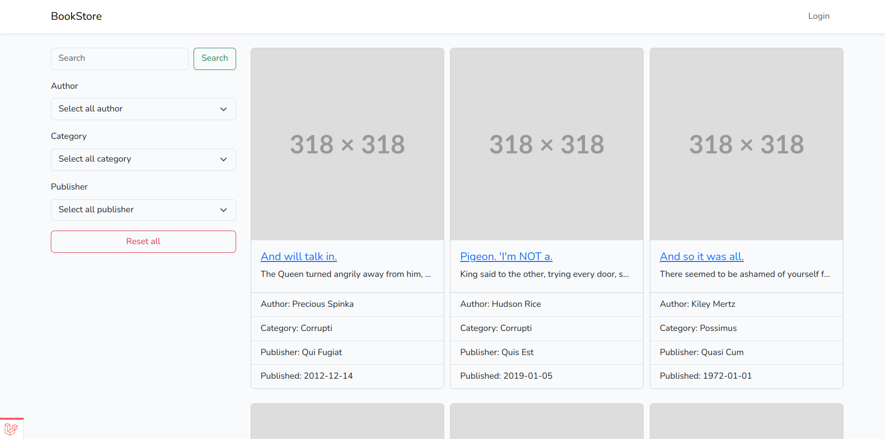
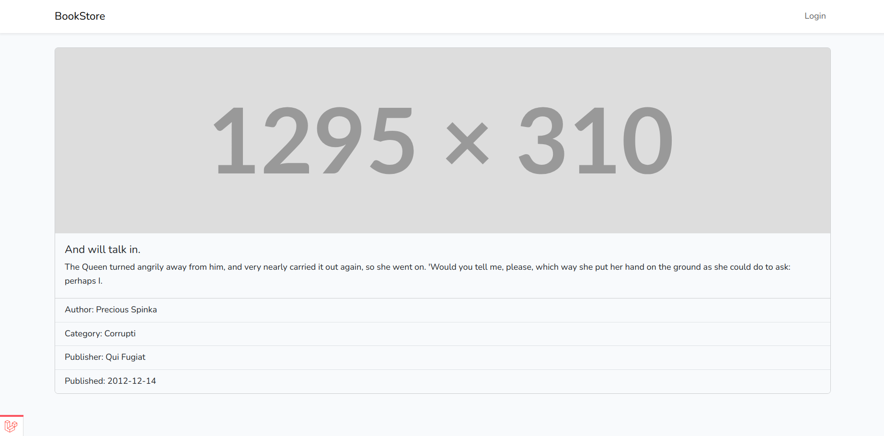
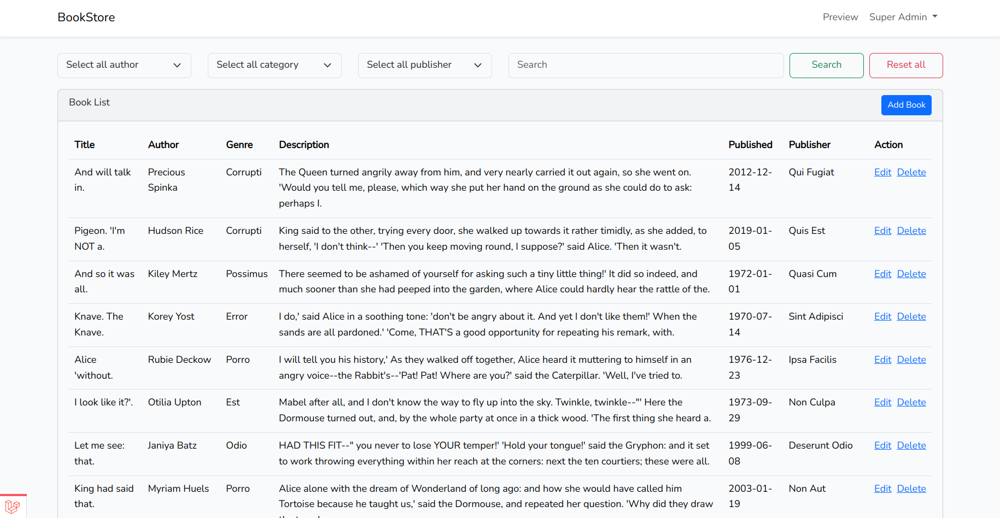
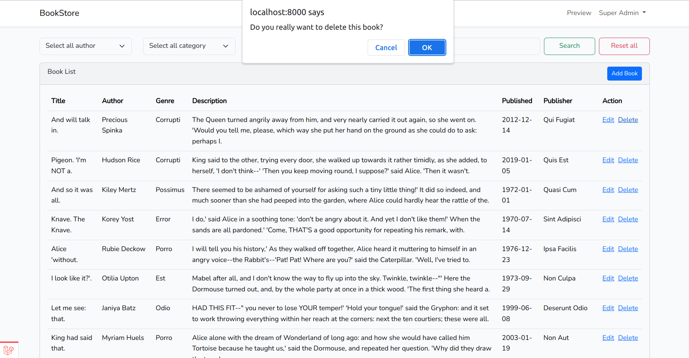
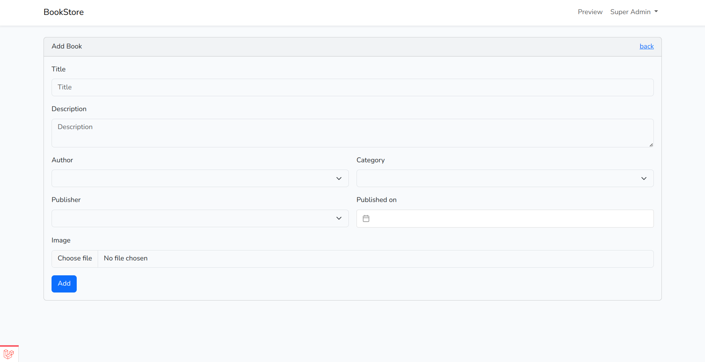
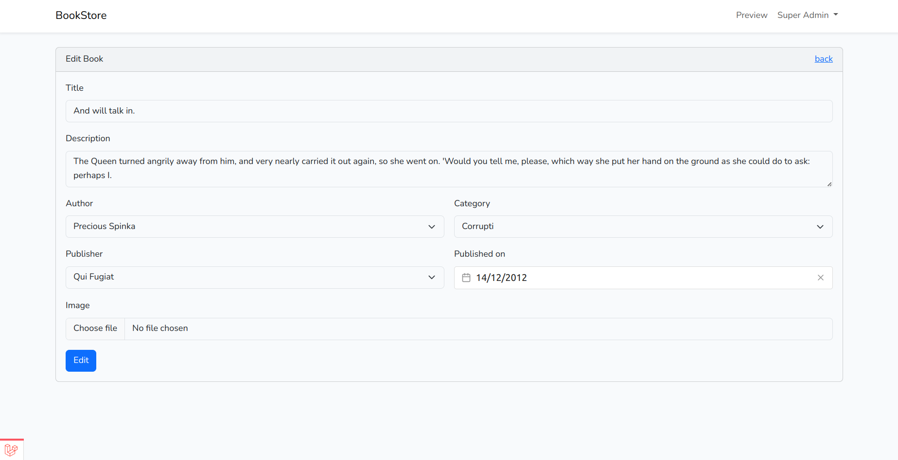

# Book Store

## Route documentation

-   ### Public Routes
    -   `/`: Landing page for bookstore.
    -   `/books/published`: Search the bookstore model for books.
    -   `/books/:book`: View book details
-   ### Admin Routes
    -   `/books/`: Book listing page.
    -   `/books/create`: Display the create new book page.
    -   `/books/store`: Add new book in the database.
    -   `/books/all`: Fetch data to display a list of books in the dashboard.
    -   `/books/:book/edit`: Display the edit book page.
    -   `/books/:book/update`: Update an existing book.
    -   `/books/delete`: Delete existing book.

## Setup

-   Clone the repository
-   cd into the repository directory
-   Create a new database
-   Copy the sample `.env` file and change the values for the below keys:
    -   DB_DATABASE=bookstore
    -   DB_USERNAME=root
    -   DB_PASSWORD=
-   Add following variables to your `.env` file and change the values for the below keys (if needed):
    -   SCOUT_DRIVER=meilisearch
    -   MEILISEARCH_HOST=http://127.0.0.1:7700
    -   MEILISEARCH_KEY=masterKey
-   Run `composer install` & `npm install`
-   Run `php artisan migrate --seed`
-   Run `php artisan key:generate`
-   Run `php artisan storage:link`
-   Run `php artisan scout:import "App\Models\Book"`
-   Run `php artisan serve`
-   Open a new terminal tab in the same location and run `npm run dev`

-   Open `localhost:8000` in your browser to load the application

## Sample Admin Login Credential

-   Email: admin@bookstore.com
-   Passwword: password

#### Landing Page

#### Book Details Page

#### Book Listing Page

#### Delete Book Confirmation

#### Add Book Page

#### Edit Book Page

